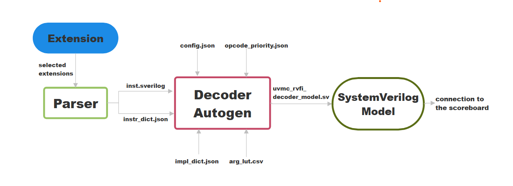

## Intro

The main goal of this project is to design a modular, SystemVerilog-based RISC-V model, in order to be able to replace the traditional Instruction Set Simulator (ISS). The model adheres to the RISC-V Formal Interface (RVFI) and supports extensions for future architectural enhancements. The model is able to support different instruction modules for easy ISA extension. 
The structure consists in 2 different python scripts, in order to autogenerate the new SystemVerilog class "uvmc_rvfi_decoder_model", already connected to the scoreboard. 

## FHigh Level Flow Diagram

An high level description of the algorithm is available here . The parser.py receives in input one or more list of extensions and gives as an output two files, containing coded instructions and var_fields. These two files are used as input for the decoder_model.py, together with other four files, containing instructions implementations and configurations parameters. All the files in the chart are provided in this path: 

core-v-verif/
├── riscv_opcodes/       (To find all possible extensions, you have to access the folder "extensions")

## Parser

Extensions are passed to the parser via command-line arguments., and by adding the flag -sverilog, you can generate in output a first file named "inst.sverilog", containing name instruction and relative instruction coding and, secondly, a json file named "instr_dict.json", where each instruction has its associated variable fields, plus other things not used for the model creation.

Example run parser.py :     $ python3 parse.py rv_i rv_c rv_m rv32_c rv32_i rv_zicsr -sverilog

The 2 new files are generated inside riscv_opcode folder.

## Decoder Model

Inst.sverilog and instr_dict.json are input files of the decoder model script. Other four files are passed as input

The class generation flow will be described in the next linesThe new class is autogenerated in this path:

* config.json, containing some configuration words that will be formatted inside the python script (Example: name of the class)

* impl_dict.json, containing an high level implementation for each instruction inside the model

* arg_lut.csv, containing the definition of all the variable fields, with relative bit start and bit end on the instruction

* opcode_priority.json, containing a list of instructions that need to be put before the others to not cause mismatch ( example c.jalr is encoded as a c.add that has rs2 = 0, but since c.add don't care about the value in rs2, if the check on the c.add is done before the check on the c.jalr, the instruction ,be it a c.jalr or a c.add, would enter the c.add branch )

The script is extracting name and variable fields for each instruction from the 2 inputs coming out the parser, and it's associating to all the extracted variable fields the start and end bit from arg_lut.csv. Then it adds the relative implementation, and, based on the instruction order on priority_opcode.json, it reorders all the set of instructions. A python template will be then formatted with all the datas collected, in order to create a new SysVerilog class named uvmc_rvfi_decoder_model. The new class is created along this path:

core-v-verif/
├── lib/
│   └── uvm_components/
│       └── uvmc_rvfi_reference_model
|                     └──uvmc_rvfi_decoder_model

## Running the model

In oredr to run the new model, you need to run a python script named run_vcs.py, and need to add a flag -test uvmt_cv32e20_model_test_dual_ref_c, because for now the model is using both our reference model and spike reference model. You have to use the correct compiler by adding the flag -march and, if you want to have the cv instructions, use "-march rv32imc_zicsr_xcvalu, alongside the correct toolchain ---> "-toolchain -toolchain /opt/eda/riscv/tools/corev-openhw-gcc-rocky8-20240530/bin/riscv32-corev-elf-". If you are using cv_instruction you need to include also the coproc and smart_lsu to the model, in particular you need to add the flag "-cop" and "-dmv", in order to include the needed rtl and be sure the model is working. These flags are STRIICTLY NECESSARY in order to achieve a correct behaviour, you can also add an additional flag -test alongside the name of the test you want to perform (default = no flag = hello world program). 
P.S Not all the tests have a correct behaviour ( not because our new model is wrong, but because there is something we still have to include ex. interrupts ). Program you can try and be sure to achieve a correct output : hello-world, fibonacci, riscv_arithmetic_basic_test_0, all the simple_cv_xxxx tests 

