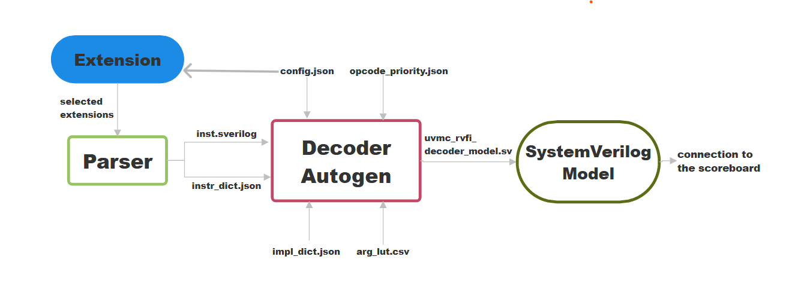

# RISCV Model Autogen Documentation

## Introduction

This document explains how to **automatically generate and run** the RISC-V UVM reference model used in the verification environment for the **CV32E20** core and its custom extensions.

The system is fully automated — all steps (opcode parsing, model generation, firmware compilation, RTL build, and simulation) are executed through a single Python entry point:

```bash
python3 run_vcs.py [options]
```

You do **not** need to call the autogen or other scripts manually.  
Everything is handled internally by `run_vcs.py`.

---

## 1. Overview of the Flow

When you execute `run_vcs.py`, it performs the following phases automatically:

1. **Environment setup** – configures paths, toolchain, and defines.
2. **Opcode parsing** – generates `inst.sverilog` from the ISA definitions.
3. **Model autogeneration** – creates the SystemVerilog reference model class (`uvmc_rvfi_decoder_model.sv`).
4. **Firmware compilation** – compiles BSP (boot code, handlers, syscalls) and the selected test program.
5. **RTL and UVM compilation** – builds the VCS simulation environment.
6. **Simulation execution** – launches VCS, runs the test, and collects results.

All commands for these stages are defined in `utils/fmt.py` and automatically executed by `run_vcs.py`.

---


## 2. Internal Operation


### a) Opcode Parsing (automatic)
The parser is a script in ../risxv-opcodes/parse.py invoked automatically by `run_vcs.py` (via the template in `fmt.py`):
it generates the file `inst.sverilog` containing all opcode encodings and the file `instr_dict.json`, where each instruction has its associated variable fields, plus other parameters not used for the model autogeneration.  
The parser allows to manually choose the instruction extension to be used in the test. These extensions can be specified directly in the **`model_config.json`** file under the "extensions" field, allowing full customization of the instruction set used during generation.

The following table lists all ISA extensions that can be parsed and modeled; standard ones are part of the official RISC-V spec, while unratified entries refer to project-specific CV custom instructions.
| Extension | Description | Type | Notes |
|:-----------|:-------------|:------|:------|
| `rv_i` | Base integer instruction set | Standard | Core RISC-V integer operations |
| `rv_c` | Compressed instructions | Standard | 16-bit instruction encodings |
| `rv_m` | Integer multiplication and division | Standard | Adds `mul`, `div`, `rem` instructions |
| `rv32_c` | Compressed instruction subset for RV32 | Standard | 32-bit variant of compressed ISA |
| `rv32_i` | Base integer ISA for 32-bit cores | Standard | Common base for all RV32 systems |
| `rv_zicsr` | Control and Status Register extension | Standard | Enables CSR read/write access |
| `rv_system` | System instructions | Standard | Includes `wfi` and `mret` instructions |
|||||
| `unratified/rv_addsub` | Custom add/sub extension | Unratified | Custom add and sub ops |
| `unratified/rv_addsubls3` | Custom Add/Sub with LS3 field | Unratified | Custom add and sub ops using LS3 operand field |
| `unratified/rv_clip` | Clipping operations | Unratified | Custom clip instructions |
| `unratified/rv_cmpsimd` | SIMD compare operations | Unratified | Adds cv.cmp family instructions |
| `unratified/rv_dotpsimd` | SIMD dot-product operations | Unratified | Adds Dotproducts instructions |
| `unratified/rv_gen_alu` | Generic ALU custom extension | Unratified | Generalized arithmetic/logic ops |
| `unratified/rv_gensimd` | Generic SIMD extension | Unratified | Base ops for custom SIMD behaviors |
| `unratified/rv_mac32` | 32-bit multiply-accumulate extension | Unratified | Adds cv.mac instructions |
| `unratified/rv_mac168` | 16×8-bit multiply-accumulate | Unratified | MAC ops for mixed widths |
| `unratified/rv_mul168` | 16×8-bit multiply operations | Unratified | multiplication ops for mixed widths |
| `unratified/rv_postinc_load_store` | Post-increment load/store extension | Unratified | Adds load and store custom ops |


### b) Autogeneration of the Decoder Model (automatic)

`run_vcs.py` calls the autogen script:

Input file of autogen are:

| File | Generated by |
|:------|:--------------|
| **`inst.sverilog`** | `parse.py` | 
| **`instr_dict.json`** | `parse.py` | 
| **`instr_impl.json`** | Manual | 
| **`../../riscv-opcodes/arg_lut.csv`** | Predefined | 
| **`opcode_priority.json`** | Manual | 
| **`model_config.json`** | Manual |

This creates a SystemVerilog class whose name can be set in **`model_config.json`** file under the "name" field (current name : uvmc_rvfi_decoder_model). This class:

- Read instructions from the memory (`$readmemh`)
- Decodes each instruction (`casez (instr)`).
- Extracts its variable fields (`rd`, `rs1`, `rs2`, `imm12`, etc.).
- Inserts its implementation.
- Fill a transaction and sends it to the scoreboard.

The generated file is placed in:

```
core-v-verif/lib/uvm_components/uvmc_rvfi_reference_model/
```

**`This model is regenerated every time you run run_vcs.py`**.

**Execution mode:** the generated model defaults to **step mode** (transaction-synchronized with the DUT).

High level description of the algorithm: 

---

## 3. How to Use It

### Basic Run
```bash
python3 run_vcs.py 
```

This runs a complete build and simulation using:
- SPIKE as reference model,
- the “hello-world” program test,
- the `rv32imc_zicsr` architecture profile.

### Basic Run (autogenerated RVFI model)
```bash
python3 run_vcs.py   -test uvmt_cv32e20_model_test_c   -program <_program_to_run_>   -march rv32imc_zicsr
```

This runs a complete build and simulation using:
- the autogenerated RVFI model,
- the "_program_to_run_" firmware test,
- and the `rv32imc_zicsr` architecture profile.

### Run with CVXIF (coprocessor and data mover)
```bash
python3 run_vcs.py   -test uvmt_cv32e20_model_test_with_cvxif_c   -program <_program_with_cv_instr_>   -march rv32imc_zicsr_xcvalu_xcvsimd_xcvmac_xcvmem   -cop -dmv
```

When you use `-cop` and `-dmv`:
- Adds the cvxif to the autogen call.
- Includes the coprocessor and data mover filelists.
- Enforces that the chosen test name contains `cvxif`.

This runs a complete build and simulation using:
- the autogenerated RVFI + CVXIF model,
- the "_program_with_cv_instr_" firmware test,
- and the `rv32imc_zicsr_xcvalu_xcvsimd_xcvmac_xcvmem` architecture profile.

### Run with Dual Reference (Spike + Autogen)
```bash
python3 run_vcs.py   -test uvmt_cv32e20_model_test_dual_ref_c   -program <_program_to_run_>
```

This runs the testbench with both the autogenerated model and the Spike reference model for comparison.

---

## 4. Supported UVM Tests

| Test Name | Description |
|------------|-------------|
| `uvmt_cv32e20_firmware_test_c` | Uses Spike as reference model (default) |
| `uvmt_cv32e20_model_test_c` | Uses only the autogenerated RVFI model |
| `uvmt_cv32e20_model_test_dual_ref_c` | Runs Spike and the autogenerated model together |
| `uvmt_cv32e20_model_test_with_cvxif_c` | Uses the autogenerated RVFI model alongside the CVXIF model |

---

## 5. Supported March Values

`run_vcs.py` validates that the selected `-march` flag is allowed.  
Available architectures include:

```
rv32imc_zicsr                  (default)
rv32imc
rv32imc_zicsr_xcvalu_xcvsimd_xcvmac_xcvmem
```

These correspond to progressively extended instruction sets including custom CV extensions.

---

## 6. Common Command-Line Options

Use `python3 run_vcs.py -h` to see all options. The most relevant:

| Flag | Description |
|------|--------------|
| `-test` | Choose which UVM test to run (see list above). |
| `-program` | Select firmware to compile and run (e.g., `hello-world`, `fibonacci`, custom simple_cv_* tests). |
| `-march` | Architecture configuration (validated by the script). |
| `-cop` / `-dmv` | Include coprocessor and data mover. Required for CVXIF tests. |
| `-toolchain` | Path to the RISC-V GCC toolchain prefix |

---

## 7. Output Files

After a successful run, results are located in:

```
log/default/vcs_results/default/<program>/0/
```

| File | Description |
|-------|-------------|
| `vcs-<test>_<program>.log` | Full VCS simulation log. |
| `<program>.yaml` | UVM summary report. |
| `<program>.elf` | Compiled firmware image. |
| `<program>.hex` | Memory image loaded into simulation. |
| `<program>.itb` | Instruction trace binary (for waveform inspection). |


---


## 8. Example Workflow Summary

1. **Enter the project directory**
   ```bash
   cd core-v-verif
   ```
2. **Run the full flow**
   ```bash
   python3 run_vcs.py -test uvmt_cv32e20_model_test_c -program hello-world
   ```
3. **Check the generated model**
   ```
   core-v-verif/lib/uvm_components/uvmc_rvfi_reference_model/uvmc_rvfi_decoder_model.sv
   ```
4. **Inspect simulation logs**
   ```
   log/default/vcs_results/default/hello-world/0/
   ```
5. **Modify JSON or run different tests** to add or change instructions, then rerun the same command.

---

## 9. Key Advantages

- Fully automated generation — no manual SystemVerilog coding.
- Supports standard, arithmetic, compressed and CV custom extensions.
- UVM compliant and automatically integrated into the UVM environment.
- Synchronization with RTL via RVFI and optional CVXIF transactions.

---

## 10. Summary

- The **only** command you need is:

  ```bash
  python3 run_vcs.py [options]
  ```

- `run_vcs.py` automatically handles:
  - Opcode parsing  
  - Autogen model generation  
  - Firmware build  
  - RTL compile and simulation

- The generated model lives in:
  ```
  lib/uvm_components/uvmc_rvfi_reference_model/
  ```


